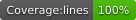

<h1 align="center">React Initial</h1>
<p align="center">A simple React component to generate Gmail-like text avatars for profile pictures.</p>

[](https://www.npmjs.com/package/react-initial)
[](https://www.npmjs.com/package/react-initial)
[](LICENSE)


## Usage

```jsx
import React from 'react'
import { Initial } from 'react-initial'

function MyComponent() {
  return (
    <Initial
      name='Bruno Carvalho de Araujo'
    />
  )
}

export default MyComponent
```

The component renders an `` whose `src` is a base64-encoded SVG data URI, so it requires no external assets or network requests.

## Props

The `Initial` component accepts a set of props to customize its behaviour:

| **Name**     | **Type** | **Description**                                                       | **Default**        |
|--------------|----------|-----------------------------------------------------------------------|--------------------|
| `className`  | string   | Class name applied to the ``                                     | (none)             |
| `style`      | object   | Inline style applied to the ``                                   | (none)             |
| `name`       | string   | Name of the user whose initial(s) should be generated                 | `'Name'`           |
| `color`      | string   | Background color of the profile picture                               | auto (from palette)|
| `seed`       | number   | Number used to randomize the background color                         | `0`                |
| `charCount`  | number   | Number of characters to show in the picture                          | `1`                |
| `textColor`  | string   | Color of the text                                                     | `#ffffff`          |
| `height`     | number   | Height of the picture                                                 | `100`              |
| `width`      | number   | Width of the picture                                                  | `100`              |
| `fontSize`   | number   | Font size of the character(s)                                         | `60`               |
| `fontWeight` | number   | Font weight of the character(s)                                       | `400`              |
| `fontFamily` | string   | Font family of the character(s)                                       | Helvetica Neue     |
| `radius`     | number   | Border radius (rounded corners)                                       | `0`                |
| `useWords`   | boolean  | Split the characters across words instead of taking them in order     | `false`            |

## Installation

```sh
npm install react-initial
```

## Development

```sh
npm install        # install dependencies
npm test           # run the test suite
npm run build      # compile TypeScript to dist/
```

## License

[MIT](LICENSE) — Copyright (c) 2020-present, Bruno Carvalho de Araujo.
